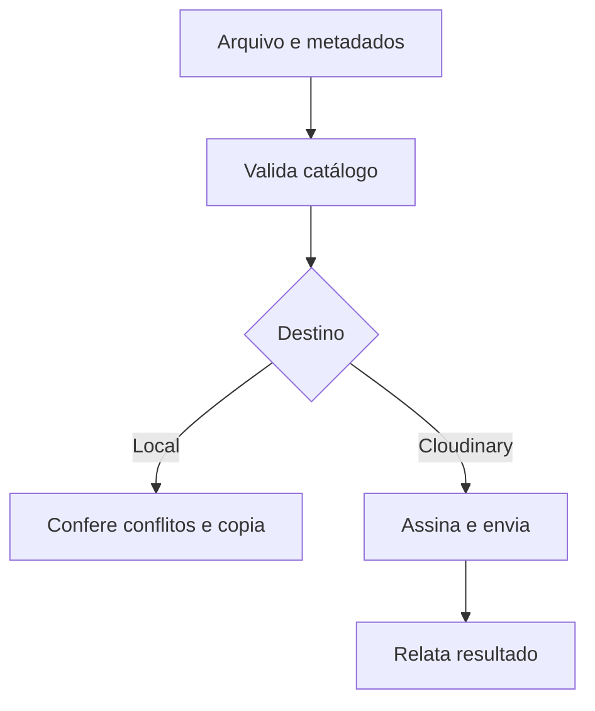

  

# Distribuição de imagem

A imagem validada pode seguir ao frontend ou ao armazenamento.

```mermaid
flowchart TD
 A[Arquivo e metadados] --> B[Valida catálogo]
 B --> C{Destino}
 C -->|Local| D[Confere conflitos e copia]
 C -->|Cloudinary| E[Assina e envia]
 E --> F[Relata resultado]
```

Conflito local, metadado inválido e falha de upload impedem completar a distribuição correspondente.
