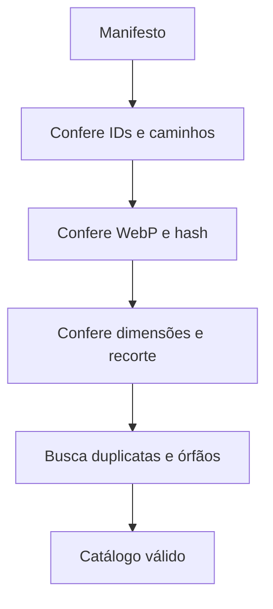

  

# Validação do catálogo

A validação relaciona cada entrada a um arquivo real antes da distribuição.

```mermaid
flowchart TD
 A[Manifesto] --> B[Confere IDs e caminhos]
 B --> C[Confere WebP e hash]
 C --> D[Confere dimensões e recorte]
 D --> E[Busca duplicatas e órfãos]
 E --> F[Catálogo válido]
```

Qualquer divergência produz falha e interrompe a operação.
